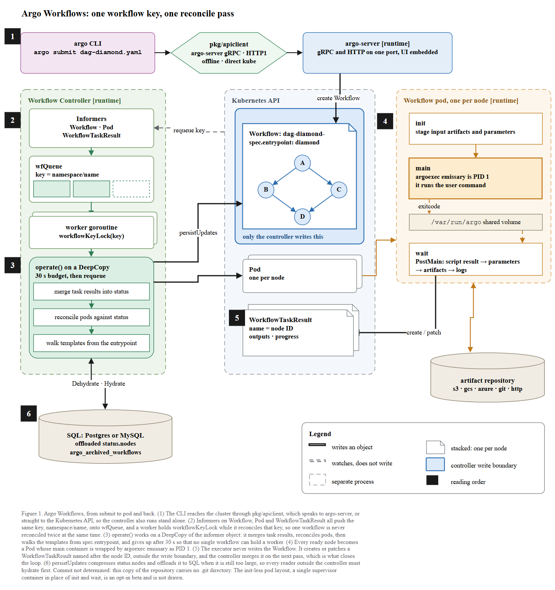

# Argo Workflows: method-figure run report

Repository read: `C:\Users\youngseolee\OneDrive - Microsoft\Desktop\work\code\paper-trail\eval\demo\sandbox\argo`
Outputs: `C:\Users\youngseolee\OneDrive - Microsoft\Desktop\work\code\paper-trail\out\demo\argo\run\`

| file | what it is |
|---|---|
| `figure.drawio` | the figure, editable draw.io XML |
| `fig.html` | standalone viewer, built by `scripts/render_view.py` |
| `render.png` | final render (the one the independent gate judged) |
| `render-r1.png` | render before gate 3 passed (round 1) |
| `evidence.json` | raw output of `scripts/evidence.py` |
| `report.md` | this file |



---

## 1. Which type, and why

**T2 (execution flow).** The request was "show how this project works", and the repo is a
running system (Go, four processes, no `nn.Module` anywhere). Per SKILL §0-1 that is T2,
not T1: the boxes carry real identifiers (`wfQueue`, `WorkflowTaskResult`, `/var/run/argo`,
`argo_archived_workflows`), not domain-level examples.

## 2. Commit

`git -C <argo> rev-parse --show-toplevel` returns
`C:/Users/youngseolee/OneDrive - Microsoft/Desktop/work/code/paper-trail`, **not** the argo
folder, and `<argo>\.git` does not exist. So the SHA that `rev-parse HEAD` returns
(`09e14774bd557ab7836c18bcaab5ede8144a130b`) belongs to the *paper-trail* repository, not to
argo. Per SKILL §0 the caption therefore says **`Commit not determined`** rather than a
wrong SHA. `check_layout.py --repo <argo>` was run on every round and raised no provenance
flag.

## 3. The design claim the figure is built around (T2 rule 6)

The repo states its own invariant twice, in prose:

> "the executor never writes the Workflow object — outputs travel through `WorkflowTaskResult`
> CRs merged by the controller" — `AGENTS.md#L35`
>
> "Outputs channel: the executor **never writes the Workflow**." — `workflow/controller/AGENTS.md#L6`

That is a claim about **what cannot cross a boundary**, so per SKILL §T2 rule 6 the device is a
boundary, not a banner: the `Workflow` object sits inside a solid blue band labelled
*only the controller writes this*, the controller's `persistUpdates` arrow crosses into it, and
the pod's only write lands on `WorkflowTaskResult`, which is drawn **outside** the band. A reader
can verify the claim by checking that no arrow from the pod zone enters the blue band.

Two secondary claims, also carried structurally rather than in text:

| claim | source | device in the figure |
|---|---|---|
| one workflow is never reconciled twice at once | `controller.go#L935-L943` (`workflowKeyLock`) | queue drawn as cells feeding a single worker card that names the lock |
| big status leaves the object and goes to SQL | `hydrator.go#L94-L124` | the store is drawn off the controller with a two-headed `Dehydrate · Hydrate` arrow |

## 4. Stage decomposition and evidence

Reading order is carried by **one** device only: the black numbered badges (SKILL §T2 rule 1).

| # | stage | evidence |
|---|---|---|
| 1 | `argo submit` → `pkg/apiclient` → argo-server | `pkg/apiclient/apiclient.go#L54-L91` (offline `L69`, HTTP1 `L76`, argo-server `L81`, direct kube `L86`); `server/apiserver/argoserver.go#L216,L297`; UI embedded: `AGENTS.md#L42` |
| 2 | informers → `wfQueue` → worker under `workflowKeyLock` | `controller.go#L166` (`wfQueue`), `#L396` (workflow informer), `taskresult.go#L27-L70` (task-result informer requeues the workflow key at `L63`,`L68`), `controller.go#L1146` (pod event requeues), `#L935-L943` (`processNextItem`, `workflowKeyLock`), `#L1022` (`hydrator.Hydrate`) |
| 3 | `operate()` on a DeepCopy | `operator.go#L206` (`operate`), `L211` (`persistUpdates`), `L263` (`taskResultReconciliation`), `L1208` (`podReconciliation`), `L2182` (`executeTemplate`); 30 s budget: `controller.go#L247` (`MAX_OPERATION_TIME`), `operator.go#L177` |
| 4 | one Pod per node: `init` / `main` / `wait` | `workflow/common/common.go#L15-L20`; `cmd/argoexec/commands/emissary.go#L48` (`emissary`), `#L65` (writes `ctr/<name>/exitcode`), `#L135-L160` (reads `/var/run/argo/template`); shared path `common.go#L252` |
| 5 | executor writes `WorkflowTaskResult`, never the Workflow | `workflow/executor/postmain.go#L27-L68` (script result → parameters → artifacts → logs), `executor.go#L1026` (`ReportOutputs`), `executor/taskresult.go#L16,L73-L100` (name = node ID at `L82`) |
| 6 | `persistUpdates` dehydrates: compress, else offload to SQL | `workflow/hydrator/hydrator.go#L71` (`Hydrate`), `#L94` (`Dehydrate`), `#L102` (`CompressWorkflowIfNeeded`), `#L116` (`offloadNodeStatusRepo.Save`); `persist/sqldb/workflow_archive.go#L29` (`argo_archived_workflows`) |
| — | artifact repository drivers | directories under `workflow/artifacts/`: `s3 gcs azure oss hdfs git http raw plugin` |
| — | running example `dag-diamond` | `examples/dag-diamond.yaml#L11` (`generateName: dag-diamond-`), `#L13` (`entrypoint: diamond`), `#L18-L36` (tasks A, B, C, D and the `depends` edges drawn as the mini DAG inside the Workflow object) |

Things deliberately **not** drawn, and why: the agent pod / `WorkflowTaskSet` path for HTTP and
plugin templates (`workflow/controller/agent.go`), cron workflows, artifact GC, and the
`supervisor` init-less pod layout. The init-less layout is named in the caption because it
changes the container picture; the others were dropped to keep the body font above the
canvas-ratio floor (see §7).

## 5. Gate results

| gate | rounds to pass | result |
|---|---|---|
| ① render / XML parse | 1 | PASS |
| ② `check_layout.py --max 6 --repo <argo>` | **3** | PASS |
| ③ `check_render.js` in the viewer | **2** | PASS (flags empty) |
| ④ independent visual gate (separate agent, PNG only) | **1** | GATE: PASS |

### Gate 1 — XML parse

```
xml ok
```

### Gate 2 — `check_layout.py`, round 1 (verbatim)

```
== figure.drawio ==
  edges 17, labelled 5
  FLAG  'controller write boundary' hangs out of its container -- widen it to 456x132
  FLAG  'controller write bound' straddles the 'zone' boundary (right) -- 98% of it is inside, so grow the zone to 456x132
  FLAG  'controller write bound' straddles the 'zone' boundary (right) -- 98% of it is inside, so grow the zone to 456x132
  FLAG  'Pod' does not fit its shape (228x62) -- grow it to 276x62
  FLAG  'Figure 1. Argo Workflows, fr' does not fit its shape (976x118) -- grow it to 6668x118
  FLAG  'Informers\n Workflow · Po' is painted over the text of 'Workflow Controller\n[run' (256x2px) -- put them in separate bands
  FLAG  'argo/wf-a' has no arrow in or out -- wire it into the order or move it to the caption
  FLAG  '...' has no arrow in or out -- wire it into the order or move it to the caption
  FLAG  'merge task results into stat' has no arrow in or out -- wire it into the order or move it to the caption
  FLAG  '30 s budget, then requeue' has no arrow in or out -- wire it into the order or move it to the caption
  FLAG  'init\n stage input artifacts ' has no arrow in or out -- wire it into the order or move it to the caption
  FLAG  '/var/run/argo  : template, e' has no arrow in or out -- wire it into the order or move it to the caption
  FLAG  '1' has no arrow in or out -- wire it into the order or move it to the caption
  FLAG  '2' has no arrow in or out -- wire it into the order or move it to the caption
  FLAG  '3' has no arrow in or out -- wire it into the order or move it to the caption
  FLAG  '4' has no arrow in or out -- wire it into the order or move it to the caption
  FLAG  '5' has no arrow in or out -- wire it into the order or move it to the caption
  FLAG  '6' has no arrow in or out -- wire it into the order or move it to the caption
  FLAG  1 layer(s) paint an arrow on top of a shape -- re-emit as containers, edges, then shapes
  (zone, container, and crossing flags are not auto-fixable except --fix growing; the numbers above are the fix)
```

What I changed: shortened the legend row and the `Pod` label; broke the caption into explicit
lines (the checker measures declared lines, not wrapping); made zone titles single-line so the
`Informers` card left the title band; wired the `operate()` chips and the pod containers with
real edges (they *are* sequences) and emptied the queue cells of text so the queue is carried by
shape rather than by filler labels; restyled the badges as `text;` cells so they are read as
order markers instead of unwired components; reordered every cell as containers → edges →
leaf shapes.

### Gate 2 — round 2

```
== figure.drawio ==
  edges 22, labelled 6
  FLAG  'Informers' does not fit its shape (232x60) -- grow it to 260x60
```

Split `Workflow · Pod · WorkflowTaskResult` over two lines instead of widening the card, because
widening it would have pushed the canvas past the readability floor.

### Gate 2 — round 3 (pass, and re-run after the two post-inspection edits)

```
== figure.drawio ==
  edges 22, labelled 6
  ok
exit=0
```

### `extent.py`

```
  FULL   1018 x 1084  ratio 0.94:1
```

Within the 1.6:1 single-column ceiling. Body font is 12 px on a 1018 px canvas = **1.18%**,
above the 1.16% floor, so `check_layout.py` raised no readability flag.

### Notation check

```
emoji/glyph ['0x2192'] | font 78 / 78
em-dash 0
```

Only `→` (U+2192) survives, as SKILL §표기 규칙 allows. Every style carries
`fontFamily=Times New Roman`. All labels are English. No emoji, no circled glyphs, no em-dash.

### Gate 3 — `check_render.js`, round 1 (verbatim)

```json
{
 "counts": { "onborder": 8, "cross": 2 },
 "flags": [
  {"kind":"onborder","a":"operate() on a DeepCopy","at":[48,490]},
  {"kind":"onborder","a":"watch → requeue key","at":[271,254]},
  {"kind":"onborder","a":"persistUpdates","at":[306,431]},
  {"kind":"onborder","a":"create / patch","at":[632,491]},
  {"kind":"onborder","a":"init","at":[728,222]},
  {"kind":"onborder","a":"2","at":[34,205]},
  {"kind":"onborder","a":"3","at":[34,475]},
  {"kind":"onborder","a":"4","at":[714,207]},
  {"kind":"cross","at":[656,519]},
  {"kind":"cross","at":[707,478]}
 ]
}
```

(`note` fields elided for width; all `onborder` notes read "label sits astride a shape border -
it reads as belonging to neither side", both `cross` notes read "two arrows cross - route one
around, or add a line jump".)

That render is saved as `render-r1.png`. Fixes: narrowed the controller column from 300 to
270 px to open a 110 px corridor so the `requeue key` and `persistUpdates` labels sit in clear
space; moved the numbered badges out of the card corners into the left margin (badges 2, 3 and
4 were sitting on the card borders and clipping the first letter of `operate()` and `init`);
shortened `watch → requeue key` to `requeue key` because no corridor is wide enough for the
long form; re-ordered the Kubernetes-API column so `Pod` sits above `WorkflowTaskResult`, which
lets the pod-creation arrow and the task-result arrow use different heights and removes both
crossings; moved the artifact repository down so nothing runs across it; rerouted the
`shared volume → wait` arrow from the bottom of `wait` to its top, removing a detour.

### Gate 3 — round 2 (pass)

```json
{ "counts": {}, "flags": [] }
```

Re-run unchanged after the two edits from my own visual pass.

### Gate 4 — independent visual gate, round 1

A separate `general-purpose` agent judged `render.png` plus three zoom crops. It received the
raw `check_layout` / `extent` / `check_render` output and the repository path, and was given
neither this report, nor the stage table, nor any statement of intent. Its first reply was a
bare all-PASS with no evidence, which is exactly the failure mode `references/visual-gate.md`
warns about, so I sent it back once demanding coordinates and quotations per item. Verdict,
verbatim:

```
Opened with `view`: render.png, zoomA.png, zoomB.png, zoomC.png. Contamination check: correct Argo Workflows page.

GATE: PASS
A1 PASS  No visible spill in zooms.
A2 PASS  Dashed zones contain their contents; arrows cross borders intentionally.
A3 PASS  Traced "argo CLI" → "pkg/apiclient" → "argo-server"; traced "operate() on a DeepCopy" → Kubernetes Workflow via "persistUpdates". No arrow crosses text/another arrow.
A4 PASS  "argo-server [runtime] gRPC and HTTP on one port, UI embedded"; "operate() on a DeepCopy 30 s budget, then requeue"; "WorkflowTaskResult name = node ID outputs · progress".
A5 PASS  Caption and legend remain readable in zoomC.
A6 PASS  Machine check reports no readability/body-font-ratio flag.
B1 PASS  Argo Workflows submits a DAG workflow, reconciles it through Kubernetes, runs pods per node, records task results, and offloads large status to SQL.
B2 PASS  Order: 1 "argo CLI"; 2 "Informers"; 3 "operate() on a DeepCopy"; 4 "Workflow pod, one per node"; 5 "WorkflowTaskResult"; 6 "SQL: Postgres or MySQL".
B3 PASS  Cross-step items: "create Workflow"; "persistUpdates"; "create / patch".
B4 PASS  The structure says why: "only the controller writes this" plus "WorkflowTaskResult ... outside write boundary" shows single-writer design; "workflowKeyLock(key)" shows no concurrent reconcile.
B5 PASS  Identifier/function boxes: "pkg/apiclient" explains gRPC/HTTP/direct kube; "wfQueue key = namespace/name" explains queue key; "workflowKeyLock(key)" explains locking; "operate()" lists reconciliation actions; "PostMain" maps outputs.
B6 PASS  I would delete no shape; each visible shape carries role, state, storage, process, or order.
C1 PASS  Only black numbered squares carry reading order; dashed boxes are scopes.
C2 PASS  Rounded boxes=processes/actions; diamond=client routing; documents=Kubernetes objects; cylinder=storage; dashed boxes=process boundaries; swatches/black squares=legend/order.
C3 PASS  Every legend row has swatch and fits.
C4 PASS  Title top, legend lower-right, caption bottom.
C5 PASS  Legend line: "stacked: one per node".
Things to fix, in priority order:
1. Enlarge caption slightly; no gate-blocking issue.
```

Not acted on: the caption is at 11 px, which SKILL allows down to 9 for captions, and raising it
would push the canvas width past the readability floor. One factual slip in the judge's own
answer: the shape it calls a "diamond" (client routing) is a hexagon, the tool/adapter shape.
That is the judge's reading, not a defect in the figure, and it was not scored as a FAIL.

## 6. My own screenshot inspection (SKILL §③), one observation per item

Performed on `render.png` before handing anything to the gate.

1. **Lines through shapes** — traced all 22 edges; none passes through a shape that is neither
   its source nor its target. The closest case is `Pod → workflow pod zone`, which leaves the
   Kubernetes-API zone through its right border, as an outbound arrow should.
2. **Lines that should exist and do** — counted 22 rendered edges against 22 declared: 13 main
   flow, 4 mini-DAG (A→B, A→C, B→D, C→D), 2 between the `operate()` chips, 3 inside the pod.
   No zero-height vertex, nothing silently dropped.
3. **Crossings / cuts** — none, confirmed both by eye and by `cross: 0` in round 2.
4. **Arrowheads landing where intended** — `Dehydrate · Hydrate` and the pod-to-artifact-repository
   arrow both render with heads at both ends, which is what "two directions" needs;
   `create / patch` lands on the right edge of `WorkflowTaskResult`, not on the stacked copy behind it.
5. **Text outside boxes** — none; the longest label, `gRPC and HTTP on one port, UI embedded`,
   ends 30 px inside its card.
6. **Legend symbols vs body symbols** — this caught a real defect. The legend said
   *dashed border = separate process*, but the Workflow Controller zone was drawn with a
   **solid** border while the Kubernetes API and pod zones were dashed. The controller is a
   separate process too, so the legend was lying about one third of the figure. Fixed by making
   the controller zone dashed; the only solid-bordered container left is the blue write boundary,
   which is exactly what the legend claims it is.
7. **Labels on other shapes' borders** — clean after the round-1 reroute; the round-1 render
   (`render-r1.png`) had `create / patch` sitting on the task-result border and `requeue key`
   cutting into the Informers card.
8. **Spelling** — done by extraction, not by eye; see §8.
9. **Labels fitting inside shapes** — `Informers` needed 260 px in a 232 px card, so its
   informer list was split over two lines rather than widened.
10. **Small shapes readable** — the A/B/C/D nodes of the mini DAG are 30 px circles with 12 px
    letters; legible in `zoomB.png`.
11. **Invented symbols** — none. `·` is used only as a separator inside labels, `→` only in the
    `PostMain` sequence, both standard.
12. **Long lines crossing the figure** — the longest run is `Pod → workflow pod zone` at 74 px of
    corridor. Nothing spans the figure.

Second defect found by eye and fixed: `WorkflowTaskResult` was drawn as a stacked pair
("one per node") while `Pod` was a single box even though it is also one per node. `Pod` is now
stacked too, so the legend row *stacked: one per node* covers both.

## 7. Label cross-check against source symbols (SKILL §③-a)

Every label pulled out of the XML and matched one by one against the code:

| label in figure | source |
|---|---|
| `wfQueue`, `key = namespace/name` | `controller.go#L166`, `#L936` |
| `workflowKeyLock(key)` | `controller.go#L942` |
| `operate() on a DeepCopy` | `operator.go#L206`; DeepCopy: `workflow/controller/AGENTS.md#L3` |
| `30 s budget, then requeue` | `controller.go#L247` (`MAX_OPERATION_TIME`, default 30 s) |
| `merge task results into status` | `operator.go#L263` |
| `reconcile pods against status` | `operator.go#L1208` |
| `walk templates from the entrypoint` | `operator.go#L2182` |
| `persistUpdates` | `operator.go#L211` |
| `Workflow: dag-diamond-`, `spec.entrypoint: diamond` | `examples/dag-diamond.yaml#L11,L13` |
| `A B C D` and their edges | `examples/dag-diamond.yaml#L18-L36` |
| `WorkflowTaskResult`, `name = node ID`, `outputs · progress` | `executor/taskresult.go#L76-L85`; `Outputs`/`Progress` merged at `controller/taskresult.go#L128-L139` |
| `init` `main` `wait` | `workflow/common/common.go#L15-L17` |
| `argoexec emissary is PID 1` | `cmd/argoexec/commands/emissary.go#L48`; `AGENTS.md#L39` |
| `exitcode` | `emissary.go#L65` |
| `/var/run/argo shared volume` | `common.go#L251-L252` |
| `PostMain: script result → parameters → artifacts → logs` | `executor/postmain.go#L43-L64` |
| `pkg/apiclient`, `argo-server gRPC · HTTP1 · offline · direct kube` | `pkg/apiclient/apiclient.go#L69-L90` |
| `argo-server [runtime]`, `gRPC and HTTP on one port, UI embedded` | `server/apiserver/argoserver.go#L216,L297`; `AGENTS.md#L42` |
| `Dehydrate · Hydrate` | `hydrator.go#L71,L94` |
| `offloaded status.nodes` | `hydrator.go#L102-L124` |
| `argo_archived_workflows` | `persist/sqldb/workflow_archive.go#L29` |
| `s3 · gcs · azure · git · http` | directory names under `workflow/artifacts/` |
| `only the controller writes this` | `AGENTS.md#L35`; `workflow/controller/AGENTS.md#L6` |

No typos, no label written from memory.


## (이 절은 공개본에서 제외되었다)

원문 보고서의 이 위치에는 스킬 자체의 도구·지침에 대한 내부 검토 내용이 있다.
도면의 결함이 아니라 도구의 결함에 관한 기록이라 공개본에서는 제외하였다.
게이트가 검출한 도면 결함은 위 절들에 그대로 남아 있다.
## 9. Editing the figure

- The caption is the single cell `id=cap`. Delete it and nothing else moves.
- The legend is the group `id=legend`; select it once and the background and all twelve items go
  together.
- The title is a separate cell, `id=title`, so a slide keeps it and a paper drops it.
- The blue write boundary is `id=wband`. Deleting it removes the figure's central claim, so if you
  want a plainer picture, delete it *and* the legend row `controller write boundary` together.
- The number badges are `n1`..`n6`; deleting them removes the only reading-order device, so the
  caption's numbering would need to go too.
