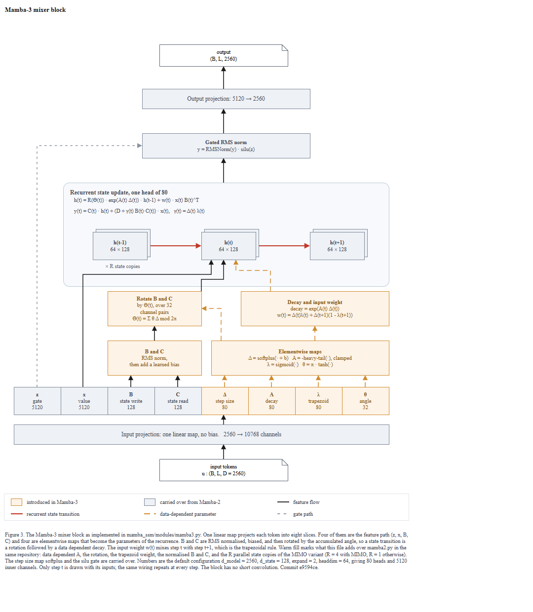

# Figure 3 — Mamba-3 mixer block

Repository read: `C:\Users\youngseolee\OneDrive - Microsoft\Desktop\work\code\paper-trail\eval\demo\repos\mamba`
`git rev-parse --show-toplevel` → `.../eval/demo/repos/mamba` (same as the target, so the SHA below is this repo's)
`git rev-parse HEAD` → `e9594ce1c732d97440f0332fdc43170a2294dbfa`

Sources used: **only files inside the repository**. The paper, the author figures, and the
images that `README.md` links (`assets/selection.png`, `assets/ssd_algorithm.png`,
`assets/mamba3.png`) were **not opened**. What to draw was decided from
`mamba_ssm/modules/mamba3.py`, the Triton kernels under `mamba_ssm/ops/triton/mamba3/`,
`mamba_ssm/modules/block.py`, `mamba_ssm/models/config_mamba.py`, and — for the colour
claim only — `mamba_ssm/modules/mamba2.py`.

Outputs in this folder:

| file | what |
|---|---|
| `figure.drawio` | the figure, editable |
| `fig.html` | viewer page (open over http, not `file://`) |
| `mamba3_blk_q7.html` | same viewer under a unique name; this is the page the independent judge was pointed at |
| `evidence.json` | raw material `evidence.py` extracted |
| `render.png` | final render |
| `zoom-top.png`, `zoom-mid.png`, `zoom-bot.png` | 1.9× zooms used for the eye check and given to the judge |

`render-r1.png` was **not** produced: the independent visual gate passed on round 1.



---

## 1. Type call

**T1 (logic of the method), sub-type T1-M (model structure).** `mamba3.py` defines
`class Mamba3(nn.Module)` with its own `forward()` and channel arguments
(`d_model`, `d_state`, `expand`, `headdim`), and there is no LLM/API client anywhere.
That is the T1-M side of the split, so the box vocabulary is tensors and configuration
values, not domain sentences.

**Topology: M-P1 (serial) with an M-P5 rollout in the middle.** The block is one straight
path `in_proj → parameter maps → recurrence → gate → out_proj`; the recurrence itself is a
time rollout (`t-1, t, t+1`), which is what `seqlen`/`chunk` iteration in the kernel is.
No U shape (there is no `down`/`up` pair), no teacher–student.

**Running example.** `evidence.py --running-example` found 0 usable candidates, which is the
normal result for T1-M — the running example here is a *configuration*, not a sentence.
I threaded the repository's own defaults through every box:
`d_model = 2560`, `n_layer = 64` (`config_mamba.py#L6,L8`), `d_state = 128`, `expand = 2`,
`headdim = 64`, `ngroups = 1`, `rope_fraction = 0.5`, `mimo_rank = 4`
(`mamba3.py#L46-L60`). Every number in the drawing is derived from those, so a reader can
recompute them: `d_inner = 5120`, `nheads = 80`, `num_rope_angles = 32`,
`d_in_proj = 10768`. Nothing is invented and there are no placeholders.

## 2. Evidence table — each element to the code

| element in the figure | code |
|---|---|
| input `u : (B, L, 2560)` | `mamba3.py#L160-L165`; `d_model` default `config_mamba.py#L6` |
| "Input projection: one linear map, no bias. 2560 → 10768" | `mamba3.py#L107` (`d_in_proj`), `#L108` (`nn.Linear(..., bias=False)`) |
| the eight slices and their order `z, x, B, C, Δ, A, λ, θ` | `mamba3.py#L106` (comment) and `#L177-L186` (`torch.split` widths) |
| `z` 5120 / `x` 5120 | `d_inner = expand * d_model` `#L92` |
| `B` 128 / `C` 128 | `d_state * num_bc_heads * mimo_rank`, `#L47`, `#L95`, SISO `mimo_rank = 1` `#L88` |
| `Δ`, `A`, `λ` each 80 | `nheads = d_inner // headdim` `#L94` |
| `θ` 32 | `num_rope_angles = (d_state * rope_fraction) // 2` `#L100-L103` |
| "B and C: RMS norm, then add a learned bias" | `B_norm`/`C_norm` `#L126-L127`, applied `#L205-L206`; `B_bias`/`C_bias` `#L121-L122`, added in `mamba3_siso_fwd.py#L313-L316` |
| `Δ = softplus(· + b)` | `mamba3.py#L196` |
| `A = -heavy-tail(·), clamped` | `#L194-L195`, `heavy_tail_activation` `#L27-L41`, `A_floor = 1e-4` `#L57` |
| `λ = sigmoid(·)` | `mamba3_siso_fwd.py#L298` |
| `θ = π · tanh(·)` | `angle_dt.py#L89` (`tanh_approx(angle) * PI`) |
| `Θ(t) = Σ θ Δ mod 2π` | `angle_dt.py#L96-L107` (cumsum of `angle * dt`, then `mod 2π`) |
| "Rotate B and C by Θ(t), over 32 channel pairs" | `mamba3_siso_fwd.py#L327-L350` (cos/sin applied to K then Q, split into pairs) |
| `decay = exp(A(t) Δ(t))` | `ADT = _A * DT` `mamba3.py#L197`; `exp2` of its cumsum `mamba3_siso_fwd.py#L386, L412, L440-L442` |
| `w(t) = Δ(t)λ(t) + Δ(t+1)(1 - λ(t+1))` | `mamba3_siso_fwd.py#L304-L306`, applied to K at `#L343`; the state-passing counterpart at `#L371` |
| state `h : 64 × 128`, one per head | `mamba3.py#L325` (`ssm_state: (batch, nheads, headdim, d_state)`) |
| `h(t) = R(Θ) · exp(AΔ) · h(t-1) + w · x B^T` | rotation `#L327-L350`, decay+accumulate `mamba3_siso_fwd.py#L440-L444` |
| `y(t) = C · h + (D + γ B·C) x`, `γ = Δλ` | `mamba3_siso_fwd.py#L406-L422`; `γ` is `gamma` `#L305`, folded into the diagonal term `#L319-L325`; `D` is `mamba3.py#L140` |
| "Gated RMS norm: y = RMSNorm(y) · silu(z)" | `mamba3.py#L143-L150` (`norm_before_gate=True`), `#L275`; the fused path multiplies by `silu(z)` in `mamba3_siso_fwd.py#L431` |
| "Output projection: 5120 → 2560" | `mamba3.py#L157` |
| `× R state copies` (stacked planes) | `is_mimo`/`mimo_rank` `#L59-L60`, `mimo_x/z/o` `#L135-L137`, rank axis in `y` `#L243-L246` |
| "no short convolution" (caption) | no `Conv1d` anywhere in `mamba3.py` (grep: 0 hits); `mamba2.py#L105` has one |
| warm = "introduced in Mamba-3" | contrast against `mamba2.py`: `d_in_proj` has no `A`/`λ`/`θ` slices `#L96`; `A` is a static learned `A_log` `#L134-L135`; no `B`/`C` norm; no MIMO rank |

`evidence.py` itself was thin here (13 components, 0 losses, 0 running examples) — it picks up
`self.<name> = <Class>()` assignments, and most of Mamba-3's structure lives in `forward()`
and in the Triton kernels. Its output is kept verbatim in `evidence.json`; the table above
came from reading those files.

## 3. Decisions worth stating

- **What the colour claims.** Warm fill = present in `mamba3.py` and absent from `mamba2.py`
  in the same repository; grey = carried over. This is a claim a reader can check against two
  files. One box is mixed: "Elementwise maps" holds four maps and only three of them are new
  (`Δ = softplus(· + b)` also exists at `mamba2.py#L313`). The caption says so in words rather
  than splitting the box, because splitting it forced a parameter arrow to cross two other
  boxes.
- **No `+` circle at the state input, deliberately.** Convention B wants a circle with `+`
  where two paths merge. Here the three incoming streams (`x`, rotated `B`, weight `w`)
  combine *multiplicatively* — `w · x B^T` — so a `+` would state the wrong operation. The
  addition is the recurrence itself and is written in the equation inside the panel.
- **Only step `t` is wired.** Drawing the same three injections at `t-1` and `t+1` tripled the
  line count for no new information. The caption says the wiring repeats.
- **Chunking is not drawn.** The kernels are chunkwise (`chunk_size = 64`, a masked
  within-chunk `Q Kᵀ` product plus cross-chunk state passing, `mamba3_siso_fwd.py#L411-L417`).
  That is an *algorithm* claim, not a block-structure claim, and putting it in would have
  needed a second panel. It is left out; if you want Figure 3 to carry it, that is the obvious
  next addition and it wants its own inset.
- **Edge labels: 0**, as T1-M requires. Operation names are all inside boxes (one mode
  throughout); the legend only names what *flows*, not what is *computed*.

## 4. Verification

### Gate ① — render

```
$ python -c "import xml.etree.ElementTree as ET; ET.parse('figure.drawio'); print('xml ok')"
xml ok

$ python render_view.py . figure.drawio=fig figure.drawio=mamba3_blk_q7
fig.html <- figure.drawio (21738 chars)
mamba3_blk_q7.html <- figure.drawio (21738 chars)
```
Served with `python -m http.server 8907`. **PASS, round 1.**

### Gate ② — `check_layout.py`

Round 1 (before any fix):

```
== figure.drawio ==
  edges 24, labelled 0
  FLAG  commit 'e9594ce' claimed in 'Figure 3. The Mamba-3 mixer block as imp' but not verified -- rerun with --repo <path>, or write 'commit not determined'
  FLAG  1 layer(s) paint an arrow on top of a shape -- re-emit as containers, edges, then shapes
  (zone, container, and crossing flags are not auto-fixable except --fix growing; the numbers above are the fix)
```

line samples were declared after its swatches and texts. The commit flag went away once
`--repo` was passed.

Round 2 (final):

```
$ python check_layout.py --repo <repo> figure.drawio
== figure.drawio ==
  edges 24, labelled 0
  ok
```

**PASS, round 2.** No label-overflow, zone, crossing, orphan, band, or font-ratio flags at any
point, so no shape was grown and no coordinate was moved by the checker.

Extent:

```
$ python extent.py figure.drawio
  FULL   820 x 1192  ratio 0.69:1
```

The figure is **taller than wide** (820 × 1192). The 1.6:1 and 3:1 guidance in the skill is
about wide figures; a portrait block diagram read bottom-to-top is the Transformer/Mamba
convention and fits a single column. Body text is 11 px on an 820 px canvas = **1.34 %**, above
the 1.16 % floor, and `check_layout.py` raised no readability flag. If you need it wider,
the two 70 px-high rows (`B and C` / `Elementwise maps`, and `Rotate` / `Decay and input
weight`) can be merged into one row of four boxes, which trades about 200 px of height for
about 200 px of width.

Notation scan:

```
emoji/glyph ['0x2192'] | font 63 / 63
em-dash: 0 | hangul: 0
```

Only `→` (U+2192) survives, which is the allowed exception; `×` is U+00D7 and is not caught by
that range. All 63 style attributes carry `fontFamily=Times New Roman`. No em-dash, no Korean.

### Gate ③ — `check_render.js` in the viewer

```
{
  "texts": 68,
  "shapes": 27,
  "edges": 26,
  "counts": {},
  "flags": []
}
```

`flags` is empty. **PASS, round 1.**

#### ③ eye check — what I actually saw in the PNGs

| # | item | observation |
|---|---|---|
| 1 | line through a shape | none. The only long runs are the grey gate line at x = 87 and the black `x` line at x = 180, both left of every box (leftmost box starts at x = 140) |
| 2 | a line I asked for that is not drawn | all 20 figure edges plus the 4 legend samples are visible in `render.png` and `zoom-*.png`; the XML declares 24 edges (`check_layout`: "edges 24") and the render reports 26 path elements, the two extra being the corner folds of the two note shapes |
| 3 | lines crossing or cutting each other | none. The three feeds into `h(t)` use three separate horizontal bands (y = 548, 556, 566) so they never share a segment |
| 4 | arrow landing in the wrong place | checked in `zoom-mid.png`: the dashed `Θ` arrow lands on the right edge of "Rotate B and C", the two black arrows land on the bottom edge of `h(t)` |
| 5 | text outside its box | none; the longest line, `w(t) = Δ(t)λ(t) + Δ(t+1)(1 - λ(t+1))`, sits well inside its 300 px box |
| 6 | legend symbols match the body | `zoom-bot.png`: warm and grey swatches match the box fills; red, orange-dashed, grey-dashed samples match the three edge styles |
| 7 | label sitting on someone else's border | none; `× R state copies` sits in clear space under `h(t-1)`, 8 px above the `x` feed line |
| 8 | spelling | done mechanically, see ③-a below |
| 9 | label fits its shape | yes; the three-line slice cells (`state write` is the longest at 11 characters in a 95 px cell) all fit |
| 10 | small shapes readable | the smallest text is 11 px; at 1.9× zoom every slice cell reads cleanly |
| 11 | invented symbols | none. No `//`, no `⊘`, no stop-gradient mark |
| 12 | a long line crossing everything | the gate line runs 489 px vertically, but at x = 87 it is outside every shape; `detours` did not flag it (run/direct = 1.0) |

#### ③-a label vs source symbol

Every label dumped from the XML and compared to the code:

```
'<b>A</b><br>decay<br>80'                                    nheads = 80              mamba3.py#L94
'<b>B and C</b><br>RMS norm,<br>then add a learned bias'     B_norm/C_norm/B_bias     #L121-L127
'<b>B</b><br>state write<br>128'                             d_state = 128            #L47
'<b>C</b><br>state read<br>128'                              d_state = 128            #L47
'<b>Decay and input weight</b> ... w(t) = Δ(t)λ(t) + Δ(t+1)(1 - λ(t+1))'   siso_fwd#L304-L306
'<b>Elementwise maps</b> ... Δ = softplus(· + b)   A = -heavy-tail(·), clamped
                              λ = sigmoid(·)   θ = π · tanh(·)'            #L194-L196, siso_fwd#L298, angle_dt#L89
'<b>Gated RMS norm</b><br>y = RMSNorm(y) · silu(z)'          #L143-L150, #L275
'<b>Rotate B and C</b> ... Θ(t) = Σ θ Δ mod 2π'              angle_dt#L96-L107
'<b>h(t)</b><br>64 × 128'  '<b>h(t+1)</b>...'  '<b>h(t-1)</b>...'   headdim × d_state  #L325
'<b>x</b><br>value<br>5120'  '<b>z</b><br>gate<br>5120'      d_inner = 5120           #L92
'<b>Δ</b><br>step size<br>80'  '<b>λ</b><br>trapezoid<br>80'  '<b>θ</b><br>angle<br>32'
'Input projection: one linear map, no bias.   2560 → 10768 channels'      #L107-L108
'Output projection: 5120 → 2560'                                          #L157
'Recurrent state update, one head of 80'                                  nheads = 80
'h(t) = R(Θ(t)) · exp(A(t) Δ(t)) · h(t-1) + w(t) · x(t) B(t)^T'
'y(t) = C(t) · h(t) + (D + γ(t) B(t)·C(t)) · x(t),   γ(t) = Δ(t) λ(t)'
'input tokens / u : (B, L, D = 2560)'   'output / (B, L, 2560)'
'× R state copies'   'Mamba-3 mixer block'
legend: 'introduced in Mamba-3' 'carried over from Mamba-2' 'feature flow'
        'recurrent state transition' 'data-dependent parameter' 'gate path'
```

No typos, no drift between the legend wording and the body wording.

### Gate ④ — independent visual gate

A separate `general-purpose` agent was given only the four PNGs, the raw output of ② and ③,
and the repository path — no report, no step table, no statement of intent. It was told to
stop if the page was about some other project. Its verdict, verbatim:

```
GATE: PASS

A1 PASS
A2 PASS
A3 PASS
A4 PASS
A5 PASS
A6 PASS — machine output: 820 x 1192, texts 68, flags [].

B1 PASS — It shows how Mamba-3 projects input tokens into gates, values, state parameters,
          updates recurrent state, normalizes/gates, and projects output.
B2 PASS
B3 PASS
B4 PASS — caption says "state transition is a rotation followed by a data dependent decay."
B5 PASS
B6 PASS

C1 PASS
C2 PASS
C3 PASS
C4 PASS
C5 PASS

Things to fix:
- Empty.
```

**PASS, round 1** — so `render-r1.png` was not created.

One caveat I will not hide: the judge's FAIL slots are empty and its answers are short, so
this is a clean pass but not a stress test. Its B4 answer points at the *caption*, not at the
drawing, which is a fair hint that the "why" of Mamba-3 (rotation, trapezoid, data-dependent
decay) is carried more by the caption and colour than by the geometry. If you want that
tightened, the lever is an inset that unfolds one rotation pair.


## (이 절은 공개본에서 제외되었다)

원문 보고서의 이 위치에는 스킬 자체의 도구·지침에 대한 내부 검토 내용이 있다.
도면의 결함이 아니라 도구의 결함에 관한 기록이라 공개본에서는 제외하였다.
게이트가 검출한 도면 결함은 위 절들에 그대로 남아 있다.
## 6. Editing it afterwards

- The **caption** is one cell, `id=cap`. Delete it and nothing else moves.
- The **legend** is one group, `id=legend`. Select it once and the box, both swatches, the four
  line samples and the six labels go together.
- The **title** is a separate cell, `id=title` — delete it for a paper, keep it for a slide.
- The **recurrence panel** is `id=panel` with `id=eq1`, `id=eq2` inside it; deleting the two
  equation cells leaves the rollout and the panel intact.
- The **MIMO stacking** is three unlabelled cells `sh1`, `sh2`, `sh3` plus the text `rlab`.
  Delete those four and the figure becomes the SISO block with nothing else disturbed.
