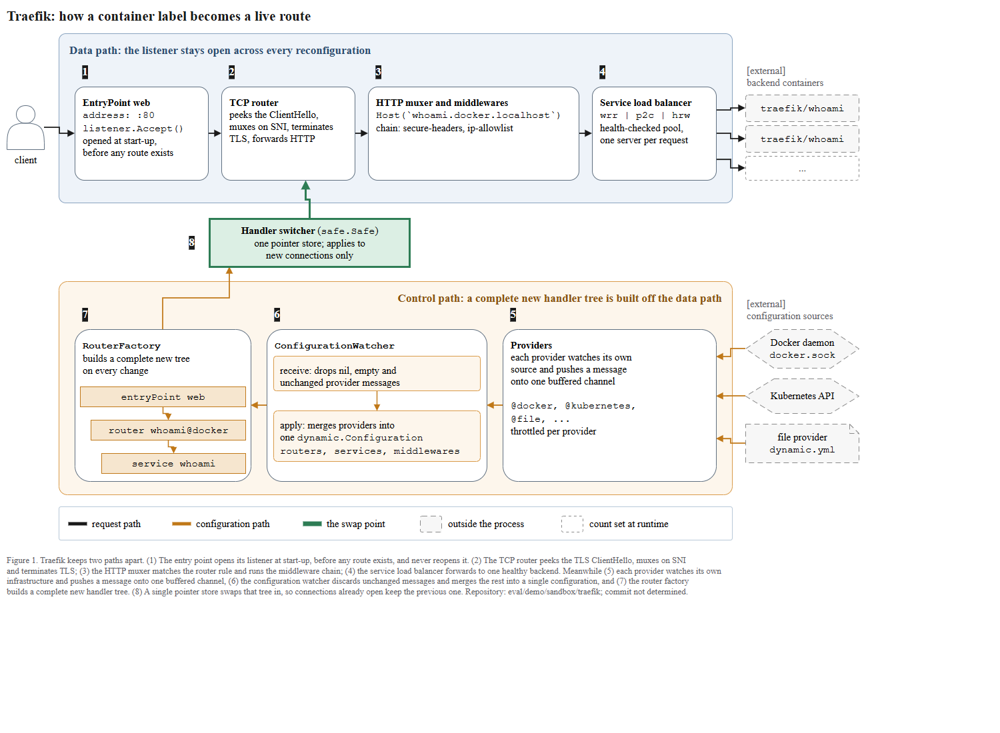

# traefik — architecture figure, run report

Target repository
: `C:\Users\youngseolee\OneDrive - Microsoft\Desktop\work\code\paper-trail\eval\demo\sandbox\traefik`

Outputs (all in this folder)
: `figure.drawio`, `fig.html`, `evidence.json`, `render.png`, `render-r1.png`, `report.md`
: extras kept for re-running the checks: `traefik_tk7.html` (uniquely named viewer handed to the gate), `check_render.js`, `zoom-1-datapath.png`, `zoom-2-switch.png`, `zoom-3-control.png`

Only files inside the repository were read. The project's documentation site was not visited. The repository ships its
own architecture drawing at `docs/content/assets/img/traefik-architecture.png` (referenced from `README.md`); it was
deliberately **not opened**, so the decomposition below is entirely code-derived. That is a knowing deviation from the
skill's checklist item 43 ("check whether the repository already drew its own architecture and compare"), taken because
the instruction for this run was that the figure must be decided by the code, not by an author-drawn picture.

---

## 1. Type call: T2 (execution flow)

The request was "이 프로젝트가 어떻게 동작하는지 보여주는 아키텍처 그림" — that is the T2 wording ("전체 흐름",
"시스템 아키텍처", "어떻게 돌아가는지"). Traefik is a runtime system: no `nn.Module`, no losses, no training. The
figure therefore uses real identifiers from the repository, not domain-level examples.

`evidence.py` agreed, by returning nothing on the T1 axes:

```
C:\...\out\demo\traefik\run\evidence.json  components=0 losses=0
```

```
components : 0
losses : 0
frozen : 0
trainable : 0
entry_points : 0
artifacts : 1277
examples : 12
files : 0
notes : 2
```

`notes` (verbatim from `evidence.json`):

```
loss 항이 없다. 학습 스크립트(train*.py, *_trainer.py)를 함께 넘겨야 방법론 그림의 관계를 그릴 수 있다.
frozen/trainable 표시가 없다. 코드에서 확인되지 않으면 사용자에게 물어야 한다.
```

Both notes are the expected "runtime system" result and were ignored. `evidence.py` produced 1277 `readme_block`
artifacts; those were useful and several of them are in the figure (the `whoami` labels, the entry-point address).

## 2. SHA

```
git -C <traefik dir> rev-parse --show-toplevel
C:/Users/youngseolee/OneDrive - Microsoft/Desktop/work/code/paper-trail

git -C <traefik dir> rev-parse HEAD
09e14774bd557ab7836c18bcaab5ede8144a130b
```

`--show-toplevel` is **not** the traefik folder — it is `paper-trail`. So `09e1477…` is the enclosing repository's
commit, not traefik's. Per §0 of the skill, a wrong SHA is worse than none, so the caption says
**`commit not determined`** and names the path instead. `check_layout.py --repo <traefik>` also passes (it raises no
provenance flag, because no SHA is claimed).

## 3. What the figure claims, and where it comes from

The design claim (skill rule 6) is stated by the authors in `README.md`:

- feature list, first line: `Continuously updates its configuration (No restarts!)`
- overview: "Traefik listens to your service registry/orchestrator API and instantly generates the routes … without
  further intervention from your part."

That claim is **not written on the figure as a banner**. It is carried by the structure, in three ways:

1. Two zones. The listener lives in the *data path* zone; everything that gets rebuilt lives in the *control path* zone.
2. The control path does not touch the listener at all. Its only exit is one small element in the corridor.
3. That element is the handler switcher, and its label is the mechanism, not a slogan: one pointer store, new
   connections only.

| box | claim | evidence |
|---|---|---|
| 1 `EntryPoint web`, `address: :80`, `listener.Accept()`, opened at start-up before any route exists | listener opens before any dynamic config exists | `pkg/server/server.go#L56-L58` (`tcpEntryPoints.Start()` runs *before* `watcher.Start()`); `pkg/server/server_entrypoint_tcp.go#L254-L263` (`Start` → `e.listener.Accept()` loop); `traefik.sample.yml` (`entryPoints.web.address: :80`); `docs/content/expose/docker/basic.md#L31` (`--entryPoints.web.address=:80`) |
| 2 `TCP router`, peeks the ClientHello, muxes on SNI, terminates TLS, forwards HTTP | request path before HTTP | `pkg/server/router/tcp/router.go#L100-L190` (`ServeTCP`), `#L410-L416` (`clientHelloInfo`, "without consuming any bytes from conn"), `#L271-L277` (`SetHTTPForwarder` / `SetHTTPSForwarder`) |
| 3 `HTTP muxer and middlewares`, `Host(\`whoami.docker.localhost\`)`, `chain: secure-headers, ip-allowlist` | rule matching then middleware chain | `pkg/server/router/router.go#L231-L262` (`buildEntryPointHandler`, `httpmuxer.NewMuxer`), `#L325-L360` (`buildHTTPHandler`, `alice.New()` chain); identifiers from `docs/content/expose/docker/basic.md#L45` and `docs/content/expose/docker/advanced.md` (`traefik.http.routers.whoami-api.middlewares=secure-headers,ip-allowlist`) |
| 4 `Service load balancer`, `wrr \| p2c \| hrw`, health-checked pool | strategy selection and health checking | `pkg/server/service/service.go#L436-L450` (`BalancerStrategyWRR / P2C / HRW / LeastTime`), `pkg/server/routerfactory.go#L123` (`serviceManager.LaunchHealthCheck(ctx)`) |
| 5 `Providers`, one buffered channel, `@docker, @kubernetes, @file, ...`, throttled per provider | provider fan-in | `pkg/provider/aggregator/aggregator.go#L69-L120` (which providers are added), `#L29-L58` (`maybeThrottledProvide`), `pkg/server/configurationwatcher.go#L48` (`make(chan dynamic.Message, 100)`), `#L84` (`providerAggregator.Provide(...)`) |
| 6 `ConfigurationWatcher` — receive drops nil / empty / unchanged; apply merges into one `dynamic.Configuration` with `routers, services, middlewares` | the dedup + merge stage | `pkg/server/configurationwatcher.go#L98-L156` (`receiveConfigurations`: "Skipping nil / empty / unchanged configuration"), `#L161-L194` (`applyConfigurations`, `mergeConfiguration`), `#L258-L261` (the `Routers` / `Services` / `Middlewares` sections) |
| 7 `RouterFactory` builds a complete new tree; `entryPoint web` → `router whoami@docker` → `service whoami` | a whole tree is rebuilt, not patched | `pkg/server/routerfactory.go#L101-L148` (`CreateRouters` builds a new service manager, middleware builder, router manager, TCP and UDP managers on every call), `cmd/traefik/traefik.go#L444-L453` (`switchRouter` calls `runtime.NewConfig(conf)` then `CreateRouters`) |
| 8 `Handler switcher (safe.Safe)`, one pointer store, new connections only | the swap point | `pkg/tcp/switcher.go` (`// Switch sets the new TCP handler to use for new connections.`, `s.router.Set(handler)`), `pkg/middlewares/handler_switcher.go` (`UpdateHandler` → `h.handler.Set`), `pkg/server/server_entrypoint_tcp.go#L381-L401` (`SwitchRouter`) |
| external: `Docker daemon docker.sock`, `Kubernetes API`, `file provider dynamic.yml` | config sources | `pkg/provider/` (`docker`, `kubernetes*`, `file`, and 11 more directories), `traefik.sample.yml` (`unix:///var/run/docker.sock`) |
| external: `traefik/whoami` backends | the running example | `docs/content/expose/docker/basic.md#L38-L46` |

Reading order is a single device: the numbered badges 1→8, which run clockwise from the top-left listener, along the
request path, and back along the configuration path. No edge labels are used; every payload name lives inside a box,
which is the esbuild convention and keeps the edge-label count at 0 (the T2 ceiling is 6).

## 4. Gate results

| gate | rounds to pass | result |
|---|---|---|
| ① render (XML parses, viewer builds) | 1 | PASS |
| ② `check_layout.py --max 6 --repo <traefik>` | 3 | PASS (0 flags) |
| ③ `check_render.js` in the viewer | 2 | PASS (`flags: []`) |
| ④ independent visual gate (separate agent, PNGs only) | 1 | **GATE: PASS**, with one C-level must-fix |

### ② check_layout — round 1 (raw stdout)

```
== figure.drawio ==
  edges 12, labelled 0
  FLAG  'Figure 1. Traefik keeps two ' does not fit its shape (1290x86) -- grow it to 4932x86
  FLAG  '1' has no arrow in or out -- wire it into the order or move it to the caption
  FLAG  '2' has no arrow in or out -- wire it into the order or move it to the caption
  FLAG  '3' has no arrow in or out -- wire it into the order or move it to the caption
  FLAG  'srv' has no arrow in or out -- wire it into the order or move it to the caption
  FLAG  'srv' has no arrow in or out -- wire it into the order or move it to the caption
  FLAG  '...' has no arrow in or out -- wire it into the order or move it to the caption
  FLAG  '4' has no arrow in or out -- wire it into the order or move it to the caption
  FLAG  '8' has no arrow in or out -- wire it into the order or move it to the caption
  FLAG  'entryPoint web' has no arrow in or out -- wire it into the order or move it to the caption
  FLAG  'router whoami@docker' has no arrow in or out -- wire it into the order or move it to the caption
  FLAG  '7' has no arrow in or out -- wire it into the order or move it to the caption
  FLAG  'receive: drops nil, empty an' has no arrow in or out -- wire it into the order or move it to the caption
  FLAG  'services' has no arrow in or out -- wire it into the order or move it to the caption
  FLAG  '6' has no arrow in or out -- wire it into the order or move it to the caption
  FLAG  '@docker' has no arrow in or out -- wire it into the order or move it to the caption
  FLAG  '@kubernetes' has no arrow in or out -- wire it into the order or move it to the caption
  FLAG  '@file' has no arrow in or out -- wire it into the order or move it to the caption
  FLAG  '...' has no arrow in or out -- wire it into the order or move it to the caption
  FLAG  '5' has no arrow in or out -- wire it into the order or move it to the caption
  FLAG  1 layer(s) paint an arrow on top of a shape -- re-emit as containers, edges, then shapes
  (zone, container, and crossing flags are not auto-fixable except --fix growing; the numbers above are the fix)
```

What was changed:

- the caption was one unbroken line, so the checker measured it as 4932px wide. Four explicit `&#10;` breaks fixed it.
- every orphan flag was a decorative sub-part. Three were removed or re-shaped rather than papered over:
  - the load-balancer's `srv / srv / ...` cells moved **out** of the box and became three real backend shapes with
    three real edges from the load balancer — which is what a load balancer actually does, so the drawing got better,
    not just quieter.
  - the router-tree cells and the two watcher cards were wired with the edges that genuinely exist between them
    (`entryPoint → router → service`, and `receiveConfigurations → applyConfigurations`, which is the `newConfigs`
    channel in `configurationwatcher.go#L148`).
  - the 2×2 provider-message chips were dropped and their names folded into the `Providers` box as a Courier line.
    This is a real loss: the queue is no longer *drawn*, only named. It was the least bad of the options, because the
    24px gaps between the control-path boxes leave nowhere to put a queue that anything could point at.
  - the number badges became `text;`-styled cells with `labelBackgroundColor=#1a1a1a`, which is how the checker
    distinguishes a label from a component.

### ② check_layout — round 2 (raw stdout)

```
== figure.drawio ==
  edges 17, labelled 0
  FLAG  1 layer(s) paint an arrow on top of a shape -- re-emit as containers, edges, then shapes
```

```
== figure.drawio ==
  edges 17, labelled 0
  FLAG  1 layer(s) paint an arrow on top of a shape -- re-emit as containers, edges, then shapes
[스킬 도구 관련 출력은 공개본에서 제외되었다]
```

result is the script's own answer rather than my guess. `figure.drawio.bak` left behind by the crashed run was deleted.

### ② check_layout — final (raw stdout, exit code 0)

```
== figure.drawio ==
  edges 17, labelled 0
  ok
```

### ③ check_render.js — round 1 (raw result)

```json
{
  "texts": 75,
  "shapes": 25,
  "edges": 19,
  "counts": { "onborder": 8, "online": 2 },
  "flags": [
    { "kind": "onborder", "a": "1", "at": [85, 92],   "note": "label sits astride a shape border - it reads as belonging to neither side" },
    { "kind": "onborder", "a": "2", "at": [257, 92],  "note": "label sits astride a shape border - it reads as belonging to neither side" },
    { "kind": "onborder", "a": "3", "at": [428, 92],  "note": "label sits astride a shape border - it reads as belonging to neither side" },
    { "kind": "onborder", "a": "4", "at": [690, 92],  "note": "label sits astride a shape border - it reads as belonging to neither side" },
    { "kind": "onborder", "a": "8", "at": [243, 247], "note": "label sits astride a shape border - it reads as belonging to neither side" },
    { "kind": "onborder", "a": "7", "at": [85, 376],  "note": "label sits astride a shape border - it reads as belonging to neither side" },
    { "kind": "onborder", "a": "6", "at": [310, 376], "note": "label sits astride a shape border - it reads as belonging to neither side" },
    { "kind": "onborder", "a": "5", "at": [586, 376], "note": "label sits astride a shape border - it reads as belonging to neither side" },
    { "kind": "online",   "a": "safe.Safe",            "at": [368, 270], "note": "an arrow runs across this label without belonging to it - move the label off the line" },
    { "kind": "online",   "a": "new connections only", "at": [275, 299], "note": "an arrow runs across this label without belonging to it - move the label off the line" }
  ]
}
```

`render-r1.png` is the render at this point, before the figure first passed the independent visual gate.

What was changed:

- the eight `onborder` flags were the number badges, which the F1 example places overlapping the box corner. The
  checker does not accept that, so all eight moved into the empty band above their row (and badge 8 to the left of the
  switcher, in the corridor that belongs to neither zone).
- the two `online` flags were a surprise and worth recording: the switcher was `shape=process`, which draw.io renders
  as an SVG `<path>`. `check_render.js` reads paths as arrows, so the shape's own outline was reported as an arrow
  crossing the shape's own left-aligned label. The hexagons and the note shape are also paths but were not flagged,
  because their labels are centred and the "is this label mine?" test is symmetry about the line. Fixing it meant
  giving up `shape=process`: the switcher is now a sharp-cornered rectangle with a 3px green stroke and centred text,
  which still reads as a different kind of thing from the rounded cards.
- while looking at `render-r1.png` the control-path zone title was also found to sit directly under the
  `RouterFactory → switcher` arrow, which ran through the words. No checker catches this. The zone title was moved to
  `align=right`.

### ③ check_render.js — round 2, final (raw result)

```json
{ "texts": 75, "shapes": 25, "edges": 18, "counts": {}, "flags": [] }
```

### extent.py (raw stdout, tail)

```
  x=   104 y=   762  1010x  50  
  x=    24 y=   828  1280x  84  Figure 1. Traefik keeps two paths apart. (1) The e
  FULL   1280 x 902  ratio 1.42:1
```

1.42 : 1 is inside the 1.6 : 1 single-column ceiling, so no aspect-ratio decision is being pushed back to you.
The layout was sized backwards from the readability rule: body text is 15px on a 1280px canvas = **1.17%**, just over
the 1.16% floor, which is why the boxes are as wide as they are and why nothing more was added across the page.

### notation check (raw stdout)

```
emoji/glyph [] | font 63 / 63
non-ascii chars: []
em-dash count: 0
```

All 63 styles carry `fontFamily=Times New Roman`, there are no emoji or circled glyphs, no em-dashes, and the file is
pure ASCII. All labels are English.

### ③-a label dump, checked one by one against the sources in §3

```
...
1
2
3
4
5
6
7
8
ConfigurationWatcher
Control path: a complete new handler tree is built off the data path
Data path: the listener stays open across every reconfiguration
Docker daemon | docker.sock
EntryPoint web | address: :80 | listener.Accept() | opened at start-up, | before any route exists
Figure 1. Traefik keeps two paths apart. ...
HTTP muxer and middlewares | Host(`whoami.docker.localhost`) | chain: secure-headers, ip-allowlist
Handler switcher (safe.Safe) | one pointer store; applies to | new connections only
Kubernetes API
Providers | each provider watches its own | source and pushes a message | onto one buffered channel |  | @docker, @kubernetes, | @file, ... | throttled per provider
RouterFactory | builds a complete new tree | on every change
Service load balancer | wrr | p2c | hrw | health-checked pool, | one server per request
TCP router | peeks the ClientHello, | muxes on SNI, terminates | TLS, forwards HTTP
Traefik: how a container label becomes a live route
[external] | backend containers
[external] | configuration sources
apply: merges providers into | one dynamic.Configuration | routers, services, middlewares
client
configuration path
count set at runtime
entryPoint web
file provider | dynamic.yml
outside the process
receive: drops nil, empty and | unchanged provider messages
request path
router whoami@docker
service whoami
the swap point
traefik/whoami
```

Every code-derived string was re-read from the file it came from rather than from memory:
`safe.Safe`, `listener.Accept()`, `ConfigurationWatcher`, `RouterFactory`, `dynamic.Configuration`, `wrr | p2c | hrw`,
`Host(\`whoami.docker.localhost\`)`, `traefik/whoami`, `dynamic.yml`, `docker.sock`. No spelling drift found.

### ③ screenshot inspection, item by item

Done on `render.png` (inline below), not asserted.

1. arrows through shapes — none. The only long arrow, `RouterFactory → switcher`, leaves c7's top edge at x≈247, turns
   in the empty corridor and enters the switcher's bottom-left. It crosses no shape.
2. arrows that were asked for but did not render — all 17 are present and counted: 4 request-path arrows, 3 backend
   fan-out arrows, 3 source arrows, 3 control-path arrows, the green swap arrow, and the 3 short arrows inside the
   RouterFactory tree and the watcher.
3. arrows crossing each other — none; the three backend arrows and the three source arrows fan without meeting.
4. arrows landing in the wrong place — one to note: `ConfigurationWatcher → RouterFactory` lands on the
   `entryPoint web` chip rather than the box edge, because the chip is at the vertical centre of the box. It reads
   correctly (the merged configuration is what the tree is built from) and was left.
5. text outside a box — none, at this scale or in the 1.7× crops.
6. legend symbols vs body — black rule = the black request arrows, orange rule = the orange configuration arrows,
   green rule = the green swap arrow, dashed grey box = the five external shapes, thin dashed box = the `...` backend.
   All five match.
7. labels on someone else's border — fixed in round 2; nothing left.
8. spelling — see the label dump above.
9. labels inside their shapes — yes, including the longest one, `Host(\`whoami.docker.localhost\`)` at 279px inside a
   316px box.
10. small shapes legible — the smallest text is 15px; the tree chips and the legend read cleanly at 1.7×.
11. invented symbols — none. No circled glyphs, no arrows-as-text, no `//`.
12. long lines crossing other elements — only the `RouterFactory → switcher` line is long, and it was rerouted around
    the zone title in round 2.



### ④ independent visual gate — verdict, verbatim and complete

The judge was a separate `general-purpose` agent. It was given: `render.png`, three 1.7× crops, the verbatim
`check_layout.py` / `check_render.js` / `extent.py` output, the repository path, and a contamination check naming
`traefik`. It was **not** given this report, the stage table, or any statement of intent.

```
GATE: PASS

A1 PASS
A2 PASS
A3 PASS
A4 PASS
A5 PASS
A6 PASS
B1 PASS  Traefik turns provider configuration such as Docker labels into live request routes while keeping listeners open and swapping handler trees safely.
B2 PASS
B3 PASS
B4 PASS  "listener stays open across every reconfiguration"; "complete new handler tree is built off the data path"; "new connections only"
B5 PASS
B6 PASS
C1 FAIL  "Data path" / "Control path" plus numbered badges 1-8
C2 PASS
C3 PASS
C4 PASS
C5 PASS

FACT CHECK
  HandlerSwitcher uses safe.Safe and switches handlers for new connections -- verified
  ConfigurationWatcher skips nil/empty/unchanged provider configs and applies merged configuration -- verified
  Providers are launched with per-provider throttling support -- verified

MUST FIX (priority order):
1. C-only: use either numbered steps or path/phase bands as reading-order device, not both.
```

Passed on the first round of the gate. The one FAIL is C1 and is left unfixed, deliberately:

- T2 rule 4 requires process and trust boundaries to be visible, and the whole design claim of this figure is that the
  two paths are separate. Deleting the zones would delete the claim.
- The zones are not *ordered* phases. They are two things running at the same time; the numbers cross between them
  (1→2 inside the data path, 4→5 jumps down, 8 jumps back up). A reader following the numbers is never told to read
  "zone A then zone B".
- I could not find a change that keeps the boundary visible and removes the appearance of a second ordering device.

You should know the judge disagreed with that reasoning, and it is a judgement call rather than a fact.

---

## 5. What I could not verify, and what I would change on your word

- **The running example is stitched, not observed.** `whoami.docker.localhost`, `traefik/whoami`, `secure-headers`
  and `ip-allowlist` all come from `docs/content/expose/docker/`, but the middleware names come from the *advanced*
  guide while the host rule comes from the *basic* one. The code was not run, so nothing was executed to confirm they
  compose. If you would rather the figure carried a single verbatim example, tell me which and I will swap it.
- **The provider list is truncated honestly.** `pkg/provider/` has 14 directories and `NewProviderAggregator` wires
  more entries than that (Docker, Swarm, Rest, four Kubernetes flavours, Knative, ECS, Consul Catalog, and more). No
  count is stated on the figure; the chips read `@docker, @kubernetes, @file, ...` so no unverified number is asserted.
- **UDP is not drawn.** `RouterFactory.CreateRouters` also builds UDP routers and `server.go` starts UDP entry points.
  Drawing a second, near-identical path would have doubled the width and broken the readability floor. This is an
  omission you may want reversed.
- **ACME / TLS certificate resolution is not drawn.** `traefik.go` registers ACME and Tailscale providers and four
  more configuration listeners on the same watcher. They hang off step 6 and were left out for the same reason.
- **The buffered channel is named, not drawn.** See §4, round 1. If you want it drawn as a queue, the control row has
  to lose a box to make room.


## (이 절은 공개본에서 제외되었다)

원문 보고서의 이 위치에는 스킬 자체의 도구·지침에 대한 내부 검토 내용이 있다.
도면의 결함이 아니라 도구의 결함에 관한 기록이라 공개본에서는 제외하였다.
게이트가 검출한 도면 결함은 위 절들에 그대로 남아 있다.
## 7. Editing the file

- Caption: a single cell, `id="cap"`. Delete it and nothing else moves.
- Legend: a single group, `id="legend"`. Select it once and the background plus all ten pieces go together.
- Title: a separate cell, `id="title"`, so a slide can keep it and a paper can drop it.
- Zones: `id="zdata"` and `id="zctrl"`. They are plain rectangles behind everything, not swimlane parents, so deleting
  a zone leaves its contents in place.
- The number badges are `id="n1"` … `id="n8"`; removing all eight leaves the arrows as the only ordering device, which
  is the change the visual gate asked for if you agree with it.
